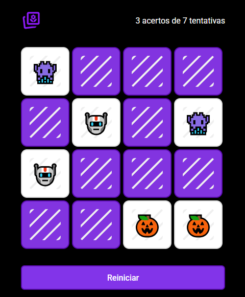

# 🧠 Jogo da Memória

Um simples e divertido jogo da memória desenvolvido com HTML, CSS e JavaScript puro.
O objetivo é encontrar todos os pares de cartas com o menor número de tentativas possível.

## 🚀 Demonstração

Ao iniciar o jogo, um grid de cartas é exibido com os emojis ocultos.
Clique para revelar as cartas e tente encontrar os pares iguais.
O jogo contabiliza suas tentativas e acertos.
Quando todos os pares forem encontrados, uma mensagem de parabéns é exibida.

## 🛠️ Tecnologias utilizadas

- HTML5
- CSS3
- JavaScript (Vanilla JS)

## 📌 Funcionalidades

- Cartas embaralhadas a cada novo jogo
- Sistema de contagem de tentativas e pares encontrados
- Feedback visual ao clicar nas cartas
- Emojis exibidos ao encontrar um par
- Mensagem ao finalizar todos os pares
- Botão para reiniciar o jogo

## 🔄 Como usar

1. Clone ou baixe este repositório.
2. Abra o arquivo `index.html` em um navegador moderno.
3. Clique nas cartas para começar a jogar.
4. Para reiniciar, clique no botão "Reiniciar Jogo".

## 🧩 Regras do Jogo

- Clique em duas cartas por vez para revelá-las.
- Se os emojis forem iguais, as cartas permanecem viradas.
- Caso contrário, as cartas são ocultadas novamente após 1 segundo.
- O jogo termina quando todos os pares forem encontrados.

## 📈 Estatísticas

Durante o jogo, o placar é atualizado com:

- Total de **pares encontrados**
- Total de **tentativas realizadas**

## 💡 Possíveis melhorias futuras

- Adição de cronômetro
- Ranking de melhores tempos e tentativas
- Níveis de dificuldade com mais cartas
- Temas diferentes (ex: animais, frutas, etc.)

## 📷 Prévia visual

  

## 🧑‍💻 Autor

Desenvolvido por **Rocketseat** e adaptado por **William Milanez** com fins educacionais e práticos.

---
